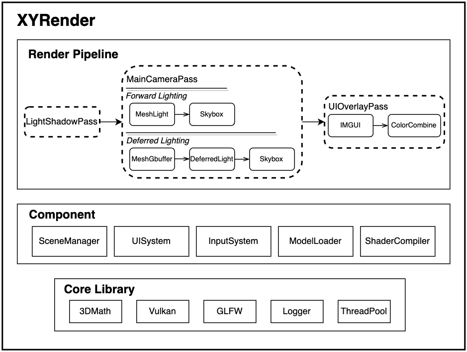

# XYRender
[](https://github.com/Naereen/StrapDown.js/blob/master/LICENSE)

XYRender is a high-performance real-time renderer implemented using C++17 and Vulkan 1.3+. It can be used for learning and practical modern graphics API development, or for game engine development.
## Features
- Comes with a complete set of third-party libraries, including Vulkan SDK, GLFW, stb_image, assimp, imgui, spdlog, and more. No need for manual downloads and configurations.
- Includes glsl shader compilation scripts. Just place shader files in the shaders directory for automatic compilation. The renderer detects file changes and recompiles shaders. Newly compiled shaders are automatically loaded by the renderer, eliminating the need for manual shader management.
- Provides a complete set of rendering pipelines, including parallel light shadow maps, forward rendering, and deferred rendering with two lighting computation methods, skybox rendering, and UI Pass.
- Encapsulates window management, input system, logging system, resource loader, renderer management, UI system, and more, making usage straightforward.
- Supports debugging with IMGUI, rendering renderer information, camera parameters, etc., within IMGUI.
- Supports advanced Vulkan features such as multithreaded rendering, One Pass Defer, Descriptor Indexing, Dynamic Buffer, and more.
- Utilizes a component-based approach for graphics API abstraction, enabling easy addition of new renderers, passes, rendering resource types, etc.
- Utilizes a left-handed coordinate system for rendering and supports importing obj and fbx models, automatically loading material textures from models.



## System Requirements

To build XYRender, you must ensure that your GPU supports Vulkan 1.3 or higher (check your GPU's support [here](https://vulkan.gpuinfo.org/listdevices.php)) and install the following tools:

### Windows 10/11
- Visual Studio 2019 (or more recent)
- CMake 3.19 (or more recent)
- Git 2.1 (or more recent)

### macOS >= 11 (arm64 only)
- Xcode 13.0 (or more recent)
- CMake 3.19 (or more recent)
- Git 2.1 (or more recent)

## Building XYRender
First, ensure that you have installed all the aforementioned tools and cloned the repository locally. Then, follow the steps below to build XYRender.
### Windows 10/11
#### Building with Visual Studio 2019
1. Create a "build" folder in the XYRender directory to store build files. Open the "build" folder, open a CMD window here, and enter the following command:
```shell
cmake -G "Visual Studio 16 2019" -A x64 ..
```
2. Open the "build" folder, double-click XYRender.sln, select the Release mode, right-click on ALL_BUILD, and click Generate.
3. Set the working directory to the root directory of the XYRender project.
4. Run XYRender.exe.

#### Building with Clion
1. Open Clion, select Open, choose the XYRender directory, and click OK.
2. Click Build->Build Project.
3. Set the working directory to the root directory of the XYRender project.
4. Click the run button.

### macOS >= 11 (arm64 only)

#### Building with Xcode
1. Create a "build" folder in the XYRender directory to store build files. Open the "build" folder, open a terminal here, and enter the following command:
```shell
cmake -G "Xcode" ..
```
2. Open the "build" folder, double-click XYRender.xcodeproj, select the Release mode, and click Build.
3. Set the working directory to the root directory of the XYRender project.
4. Run XYRender.app.

#### Building with Clion
Same as Windows.

## Usage Instructions
### Modifying the Rendering Pipeline
You can modify the rendering pipeline by adding macro definitions in CMakeLists.txt. For example:
```cmake
add_definitions(-DFORWARD_RENDERING)  # Forward rendering
add_definitions(-DDEFERRED_RENDERING) # Deferred rendering
```

### Enabling Multithreaded Rendering
Simply add a macro definition in CMakeLists.txt:
```cmake
add_definitions(-DENABLE_MULTITHREADED_RENDERING)  # Enable multithreaded rendering
```

### Model and Texture Import Instructions
Models and textures should be placed in the assets directory. Models in obj and fbx formats are supported, and textures in formats such as jpg, png, bmp, tga, etc. Models and textures are imported using the assimp library. Material textures from models are automatically loaded upon import. If a model has no textures, the import will fail. The import code for models and textures is found in scene/model.cpp and can be modified according to your needs.

Models are stored in the assets/models directory, while textures are stored in the assets/textures directory. Textures are matched to models and their materials based on the model and material names. For example, if the model is named test.obj and has a material named mat1, textures will be loaded from assets/textures/test/mat1.png. The following directory structure shows the built-in models and textures for the renderer, for reference and testing:
```
assets
├── fonts
│   └── PingFang Regular.ttf
├── models
│   ├── capsule.obj
│   ├── cube.obj
│   ├── cylinder.obj
│   ├── Kong.fbx
└── textures
    ├── capsule
    │   └── Default.png
    ├── cube
    │   └── Default.png
    ├── cylinder
    │   └── Default.png
    └── Kong
        ├── Cloth.png
        ├── Emoji.png
        ├── Eye.png
        ├── Face.png
        ├── Face_Unit.png
        ├── Hair.png
        └── TCP2_CustomRamp.png
```

## Demo


## TODO List
- [ ] Optimize the componentization of the renderer for easier addition of renderers.
- [ ] Point light shadow mapping.
- [ ] PBR rendering.
- [ ] Mac x86_64 support.

## License
XYRender is licensed under the [MIT License](LICENSE).

## References